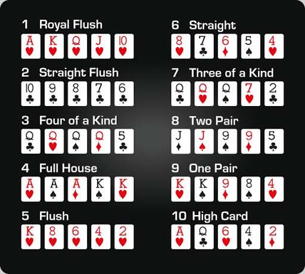

# Poker Hand Detection using YOLO



## Overview

This project showcases real-time poker hand detection using YOLO (You Only Look Once) object detection. Inspired by Murtaza's Workshop object detection tutorial, it identifies and labels playing cards in a webcam or video stream, allowing for the determination of poker hands.

The project is equipped to recognize various playing card ranks and suits, making it a fun and engaging application for card game enthusiasts and developers interested in computer vision.

## Requirements

- Python 3.7+
- Ultralytics library (`pip install ultralytics`)
- OpenCV (`pip install opencv-python`)
- cvzone (`pip install cvzone`)
- PokerHandFunction (Include instructions or a link to this custom module if it's not included in the project repository)

## Usage

1. Clone this repository to your local machine:

   ```bash
   git clone https://github.com/ysohaarsh/poker_hand_detection.git
   ```

2. Open a terminal and navigate to the project directory:

   ```bash
   cd poker-hand-detection
   ```

3. Run the poker hand detection script:

   ```bash
   python poker_hand_detection.py
   ```

   This will launch the poker hand detection application using your webcam as the video source. You can also modify the script to use a different video source if needed.

## How it Works

- The YOLO model is used to detect and classify playing cards in real-time.

- Detected cards are labeled with their ranks and suits, and their positions are marked with corner rectangles.

- The script collects the detected cards and analyzes them to determine the poker hand, displaying the result on the screen when a complete hand is detected.

## Credits

This project is inspired by Murtaza's Workshop object detection tutorial, which provided the foundation for developing the poker hand detection system.

## License

This project is licensed under the MIT License - see the [LICENSE](LICENSE) file for details.

```

Please replace `"https://github.com/yourusername/poker-hand-detection.git"` with the actual URL of your GitHub repository, and ensure that you provide clear instructions or a link to the `PokerHandFunction` module if it's not included in the project repository. You can also customize other sections as needed.